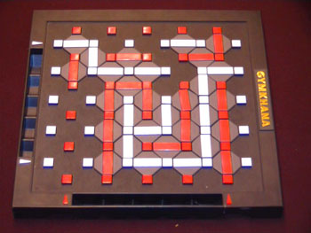

## Projet S3 : Gymkhana
### Règles du jeu

Dans ce jeu, il y a 2 joueurs. Le joueur blanc et le joueur rouge. Ils jouent sur un plateau qui contient des points rouges et blancs répartis de façon uniforme.

Les joueurs posent des barres de leur couleur respective, et peuvent relier 2 sommets de leur couleur.

Cependant, il est impossible de poser une barre à un endroit où il y en a déjà une, il se peut donc que les joueurs se bloquent le passage.

Le but du jeu est simple : le premier joueur à créer un chemin partant de son côté au côté d'en face à gagné !

